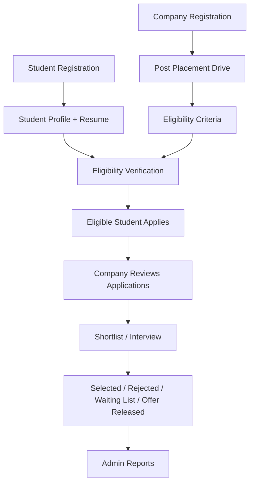
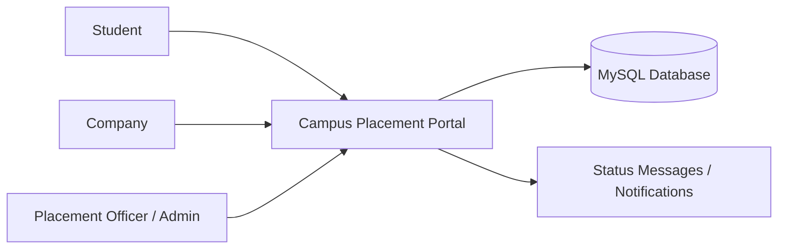
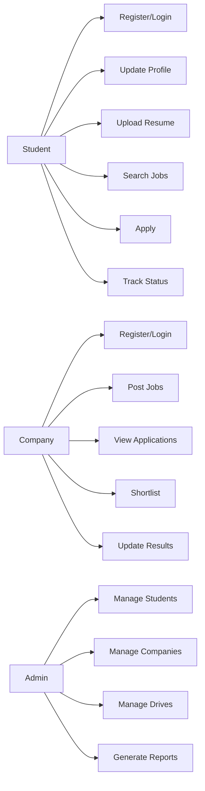

# Campus Placement Management Portal

Simple Java web application for a final-year / college project.

## Technology Stack

- Java 17
- Spring Boot 3.5.15
- Spring MVC
- Spring Data JPA
- Hibernate
- MySQL
- Thymeleaf
- No Spring Security, only simple session-based login for project demo

## Main Modules

### Student
- Register / Login
- Update profile
- Upload resume
- Search job openings
- Apply only when eligible
- Track application status

### Company
- Register / Login
- Post job opportunities / placement drives
- View eligible candidates
- View applications
- Shortlist students
- Update recruitment result

### Admin / Placement Officer
- View students
- View companies
- Verify companies
- View placement drives
- Monitor all applications
- Generate reports and analytics

## How to Run

### 1. Create MySQL database

You can create the database manually:

```sql
CREATE DATABASE campus_placement_db;
```

Or let Spring Boot create it automatically using the `createDatabaseIfNotExist=true` setting.

### 2. Add your DB credentials

Open:

```text
src/main/resources/application.properties
```

Replace:

```properties
spring.datasource.username=YOUR_MYSQL_USERNAME
spring.datasource.password=YOUR_MYSQL_PASSWORD
```

### 3. Run the application

```bash
mvn spring-boot:run
```

Open:

```text
http://localhost:8080
```

## Sample Login Data

The app automatically inserts sample records when the database is empty.

### Students
| Email | Password |
|---|---|
| rahul@example.com | 1234 |
| priya@example.com | 1234 |
| amit@example.com | 1234 |

### Companies
| Email | Password |
|---|---|
| hr@techsoft.com | 1234 |
| hr@cloudnova.com | 1234 |

Admin does not require login. Open:

```text
http://localhost:8080/admin
```

## Project Flow



## System Context



## Use Case Summary



## Notes for Students

- Passwords are stored as plain text only because this is a simple academic project.
- In a real project, use Spring Security and encrypted passwords.
- Resume files are saved in the local folder `uploads/resumes`.
- Hibernate creates and updates tables automatically using `spring.jpa.hibernate.ddl-auto=update`.

## Troubleshooting Note

If you see `LazyInitializationException` while opening the student dashboard, make sure `JobOpportunity.company`, `JobApplication.student`, and `JobApplication.jobOpportunity` use `FetchType.EAGER` in this simple project version. This project intentionally uses eager loading for these small relationships so Thymeleaf pages can display company, job, and student details easily.
